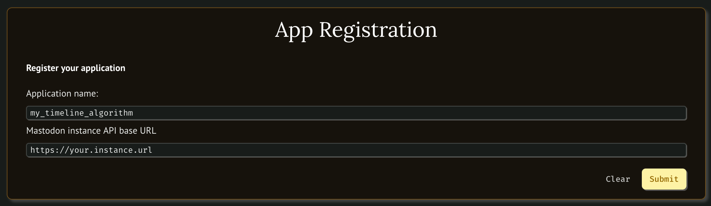

# Build Your Own Timeline Algorithm

Timeline algorithms should be useful for people, not for companies. Their quality should not be evaluated in terms of how much more time people spend on a platform, but rather in terms of how well they serve their users’ purposes. Objectives might differ, from delving deeper into a topic to connecting with like-minded communities, solving a problem or just passing time until the bus arrives. How these objectives are reached might differ too, e.g. while respecting instances’ bandwidth, one’s own as well as others’ privacy, algorithm trustworthiness and software licenses.

This notebook introduces an approach to personal, local timeline algorithms that people can either run out-of-the-box or customize. The approach relies on a stack which makes use of [Mastodon.py](https://github.com/halcy/Mastodon.py) to get recent timeline data, [llamafile](https://github.com/Mozilla-Ocho/llamafile) to calculate post embeddings locally, and [marimo](https://github.com/marimo-team/marimo) to provide a UI that runs in one’s own browser. Using this stack, you can perform search, clustering, and recommendation of posts from the fediverse without any of them leaving your computer.

# Run a local embedding server

BYOTA relies on *sentence embeddings* to internally represent statuses from your Mastodon timeline. You can think about them as numerical descriptors of Mastodon statuses that are closer the more semantically similar two statuses are.

BYOTA supports both [llamafile](https://github.com/Mozilla-Ocho/llamafile) and [ollama](https://ollama.com/) as embedding servers:

- to install a llamafile embedding server, follow the instructions you find
  [here](https://github.com/Mozilla-Ocho/llamafile/blob/main/llamafile/server/doc/getting_started.md):
  the `all-MiniLM-L6-v2` model cited there works perfectly with the current version of BYOTA, but you can also try others you can find in the *Text Embedding Models* section [here](https://github.com/Mozilla-Ocho/llamafile/).

- to install ollama and the `all-MiniLM` model, first download the executable for your OS from [here](https://ollama.com/),
  then install the model with the command `ollama pull all-minilm`. If you are curious to try more models,
  you can check the list of embedding models available [here](https://ollama.com/search?c=embedding).

> [!NOTE]
> The default embedding server URL provided in the configuration form is `http://localhost:8080/embedding` which is llamafile's default.
> If you have chosen to use ollama instead, at the moment you need to manually provide its default URL which is `http://localhost:11434/api/embed`.

# Running the notebook

- Set up and activate your favorite python env
- run `pip install -r requirements`
- run `marimo edit notebook.py`
- a browser window will open with the notebooks

The first time you run the notebook, you will need to create a new client application. You can do this by filling up the registration form with an
application name and the base URL of your Mastodon instance's API:

The Configuration section allows you to provide your credentials, choose which timeline(s) you want to download, the embeddings server API you want to use (see details in the previous section), and whether to run in offline mode (in this case statuses won't be downloaded but read from a file).

# Warning

The code is still experimental and will be subject to breaking updates in the next few weeks. Please be patient and check often for the latest updates! 🙇