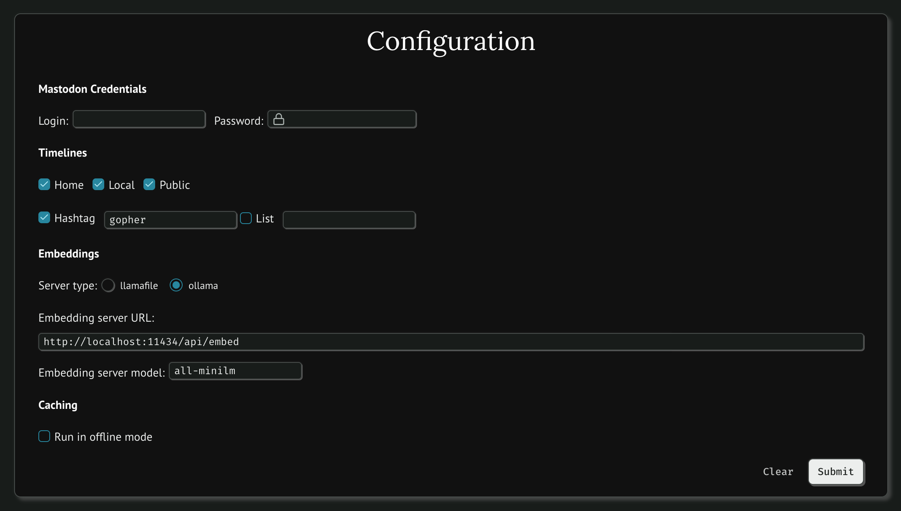

# Build Your Own Timeline Algorithm

Timeline algorithms should be useful for people, not for companies. Their quality should not be evaluated in terms of how much more time people spend on a platform, but rather in terms of how well they serve their users’ purposes. Objectives might differ, from delving deeper into a topic to connecting with like-minded communities, solving a problem or just passing time until the bus arrives. How these objectives are reached might differ too, e.g. while respecting instances’ bandwidth, one’s own as well as others’ privacy, algorithm trustworthiness and software licenses.

This notebook introduces an approach to personal, local timeline algorithms that people can either run out-of-the-box or customize. The approach relies on a stack which makes use of [Mastodon.py](https://github.com/halcy/Mastodon.py) to get recent timeline data, [llamafile](https://github.com/Mozilla-Ocho/llamafile) to calculate post embeddings locally, and [marimo](https://github.com/marimo-team/marimo) to provide a UI that runs in one’s own browser. Using this stack, you can perform search, clustering, and recommendation of posts from the fediverse without any of them leaving your computer.

# Running the notebook

- Set up and activate your favorite python env
- run `pip install -r requirements`
- run `marimo edit notebook.py`
- a browser window will open with the notebooks

The first time you run the notebook, you will need to create a new client application. To do this uncomment the cell above Configuration, choose a name for your app and the base URL the client will connect to (typically the server where your account resides). Once this step is completed, you won't have to run this cell again.

The Configuration section allows you to provide your credentials, choose which timeline(s) you want to download, the embeddings server API URL, and whether to run in offline mode. 

# Warning

The code is still experimental and will be subject to breaking updates in the next few weeks. Please be patient and check often for the latest updates! 🙇